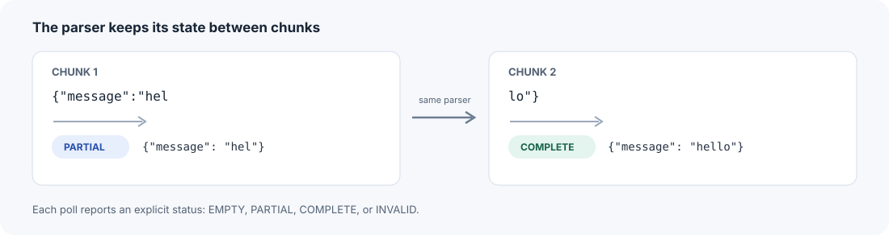
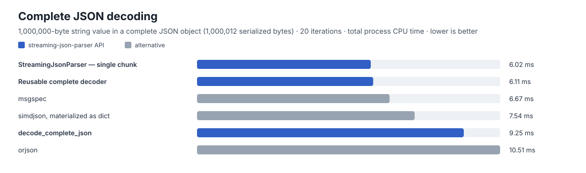
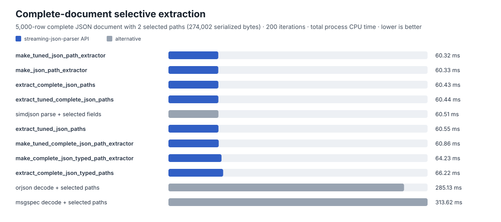
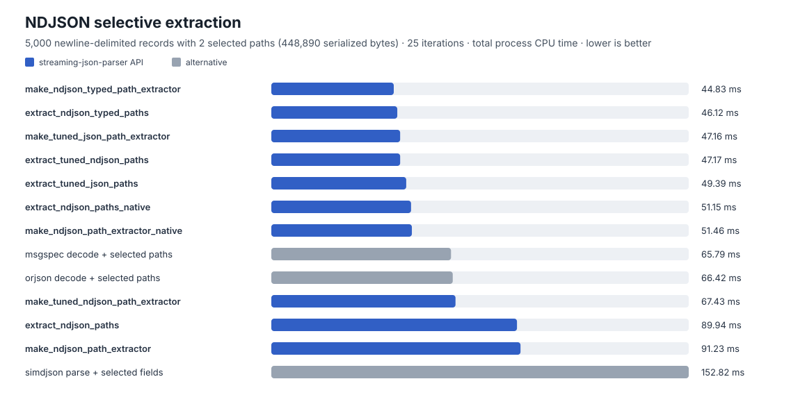
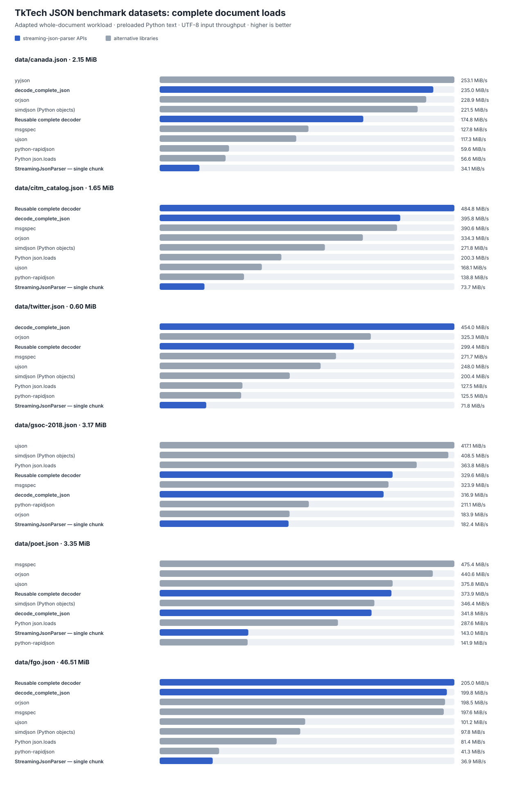

# Streaming JSON Parser

**Decode complete JSON documents or parse JSON as chunks arrive.** `streaming-json-parser` provides a strict incremental parser with partial values and explicit parse states, alongside complete-document decoding, NDJSON, and selective extraction for Python.

[](https://github.com/aramisfacchinetti/streaming-json-parser/actions/workflows/test.yml)
[](https://pypi.org/project/streaming-json-parser/)
[](https://pypi.org/project/streaming-json-parser/)
[](LICENSE)

```bash
python -m pip install streaming-json-parser
```

## Quickstart: parse while the stream is still arriving

```python
from streaming_json_parser import ParseStatus, StreamingJsonParser

parser = StreamingJsonParser()

partial = parser.feed(b'{"message":"hel')
assert partial.status is ParseStatus.PARTIAL
assert partial.value == {"message": "hel"}

complete = parser.feed(b'lo"}')
assert complete.status is ParseStatus.COMPLETE
assert complete.value == {"message": "hello"}
```

The parser resumes from its previous state on each chunk. It distinguishes `EMPTY`, `PARTIAL`, `COMPLETE`, and `INVALID` results; partial strings are available before the closing quote arrives. By default, `.value` refers to parser-owned state and may change after later chunks; pass `copy_value=True` to `feed()` when you need a retained snapshot.



## What it supports

- Strict incremental parsing across arbitrary input chunks, with partial values and explicit statuses.
- Complete JSON decoding, including reusable and workload-tuned decoders.
- NDJSON decoding and streaming records.
- Selective path extraction from complete JSON documents and NDJSON without always building every Python object.
- Structural partial snapshots for callers that do not need unfinished string values. This is a separate finishing mode, not the strict incremental state machine.
- Optional Rust acceleration through `streaming-json-parser-native`.

The Python implementation works without optional packages. The project is currently in beta while its public API settles.

## Performance

These charts show three separate workloads from the checked-in benchmark snapshot. Bars report total process CPU time for each repeated batch; **lower is better**. Every measured result is shown. Values are generated from [`docs/benchmark-snapshot.json`](docs/benchmark-snapshot.json), and the environment, versions, workload sizes, and timing method are recorded in the [benchmark report](docs/benchmark-snapshot.md).

### Complete JSON decoding

Decodes the same roughly 1 MB JSON object into a complete value. This is ordinary whole-document decoding; it does not measure incremental parsing.



### Complete-document selective extraction

Reads the same two object paths (`meta.name` and `tail.count`) from a 5,000-row JSON document. The full-decode baselines decode the document before accessing those paths.



### NDJSON selective extraction

Reads `row.id` and `row.value` from each of 5,000 newline-delimited records. Full-decode baselines materialize each record before selecting its fields.



These charts compare operations with the same output paths within each workload. Strict incremental parsers, structural partial finishers, and permissive JSON-repair tools have different semantics, so they are measured separately in the [API scorecard](docs/current-api-scorecard.md) and [partial-strategy benchmark harness](scripts/benchmark_partial_strategy_matrix.py).

### Real-world Python JSON benchmark corpus

This additional chart adapts the complete-document load workload and public datasets from the community-maintained [TkTech JSON benchmark](https://github.com/TkTech/json_benchmark). It decodes six whole documents into ordinary Python values and checks every included decoder against `json.loads` before timing. Each panel has its own scale and reports input throughput; **higher is better**. This is a Python community benchmark, not a formal industry standard. The suite's SAX/event streaming cases are omitted because they do not produce the same output as this parser.



Results vary by dataset and decoder; compare the per-file values, dataset hashes, package versions, methodology, and upstream revision in the [community corpus report](docs/community-json-benchmark.md) and [JSON snapshot](docs/community-json-benchmark.json). For an already-complete document, use a complete-document API. Sending it through `StreamingJsonParser.feed()` also performs incremental state handling, so it is not a substitute for `decode_complete_json()`. These corpus timings are separate from the generated synthetic workloads above.

## Choose an API

| Workload | API | Notes |
| --- | --- | --- |
| One complete JSON document | `decode_complete_json(data)` | Returns a regular Python value. |
| Repeated complete-document decoding | `make_tuned_complete_json_decoder(...)` | Calibrates against a representative sample and payload size. |
| JSON arriving in chunks | `StreamingJsonParser` | Strict resumable parser; inspect `ParseResult.status` and `.value` after each `feed()`. |
| Newline-delimited records | `decode_ndjson(data)` or `StreamingJsonParser(framing="ndjson")` | Call `finish()` to consume a final record without a newline. |
| Incomplete prefix; unfinished strings can be omitted | `decode_structural_partial_json(prefix)` | Structural finisher; not equivalent to strict incremental parsing. |
| A few fields from JSON or NDJSON | `make_tuned_json_path_extractor(..., framing="single" or "ndjson")` | Reuse the extractor for a stable workload. |
| Typed records | `make_ndjson_decoder(record_type=...)` | Optional typed decoding through `msgspec`. |

There is no single best backend for every input. The tuned factories can benchmark compatible backends once during setup when given a representative `sample` and `payload_size_hint`.

## Common operations

### Decode a complete document

```python
from streaming_json_parser import decode_complete_json

value = decode_complete_json(b'{"name":"example","ok":true}')
```

For large read-only payloads, `decode_complete_json_view()` can return a view backed by `simdjson`; use it only when proxy/view semantics are suitable for your application.

### Read NDJSON records

```python
from streaming_json_parser import decode_ndjson

records = decode_ndjson(b'{"id":1}\n{"id":2}\n')
```

The stateful parser also supports `framing="ndjson"` and `poll_many()` to drain complete records as they become available.

### Finish a structural partial value

Structural partial mode is useful when a caller has an incomplete prefix and needs completed objects or arrays from it. By default, it omits an unfinished trailing string; use `trailing_strings=True` or `partial_mode="structural_trailing_strings"` when that text must be retained. It may complete scalar prefixes differently from the strict parser.

```python
from streaming_json_parser import decode_structural_partial_json

value = decode_structural_partial_json('{"items":[1,2')
assert value == {"items": [1, 2]}
```

## Optional acceleration

Install the Rust extension separately when a compatible wheel is available:

```bash
python -m pip install streaming-json-parser-native
```

The native package is optional. Backend-specific packages such as `msgspec`, `orjson`, and `simdjson` are also optional; APIs fall back to the Python implementation where applicable.

## Reproduce the benchmarks

The benchmark snapshot includes the date, source revision and dirty-state flag, Python and platform details, processor and architecture, installed benchmark-package versions, native-extension availability, payload sizes, record counts, and selected paths. The methodology records its clock, warm-up, sample count, and repetitions.

To run the benchmark with the optional alternatives installed, then regenerate all reports and SVGs:

```bash
python -m pip install -e '.[test,benchmark,accelerated]'
python -m pip install 'streaming-json-parser-native==0.2.0'
make benchmark-artifacts
```

The native package is separate from the Python extras. Install it to reproduce the snapshot's native benchmark rows; the snapshot records the exact optional package versions used.

To run the adapted whole-document benchmark against the public corpus, clone the benchmark data and pass its `data/` directory. This is separate from `make benchmark-artifacts` so the everyday benchmark does not download external files:

```bash
git clone --depth 1 https://github.com/TkTech/json_benchmark.git /tmp/tktech-json-benchmark
make benchmark-community-corpus COMMUNITY_JSON_CORPUS_DIR=/tmp/tktech-json-benchmark/data
make verify-community-benchmark-artifacts
```

To verify generated Markdown, scorecard, charts, and the current benchmark results against the committed snapshot:

```bash
make verify-benchmark-artifacts
```

Verification checks generated files against the authoritative JSON snapshot and reruns the same benchmark slices. Timing checks allow shared machine slowdowns, but detect large per-implementation regressions. For meaningful comparisons, use the same dependency versions and a similar machine; compare the provenance fields in the snapshot.

## Development

```bash
python -m pip install -e '.[test]'
python -m pytest -q
```

See [contributing guidance](CONTRIBUTING.md), the [changelog](CHANGELOG.md), the [current API scorecard](docs/current-api-scorecard.md), [open issues](https://github.com/aramisfacchinetti/streaming-json-parser/issues), and [manual GitHub settings follow-up](docs/github-settings-follow-up.md).

## License

MIT. See [LICENSE](LICENSE).
